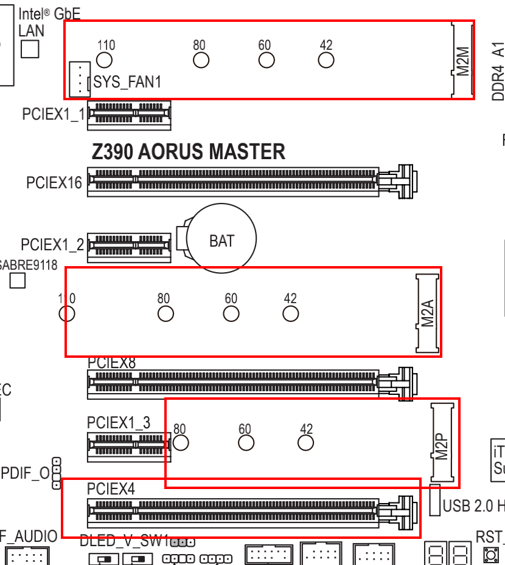

# 使用 Mac
> 这里的 Mac 指 macOS

## 命令行还是图形化?
如果要想自动化,那就命令行,如果要想有直观的用户界面,那就图形化,命令行的代表就是 Linux 系统了,图形化的代表就是 Windows 了,但是 macOS 很好的兼容了两者.

## 我是否需要全部安装?
如果你不知道安装一个软件能带来什么?那就不要安装,尽可能使用少的软件.

## 包管理工具 brew
如果你需要安装一些命令行,比如 git node mysql 等等,除了官方下载安装包,你还有另一个选择, [ brew 官网](https://brew.sh/index_zh-cn)

然后试着用它安装个命令试试看,对比其他方式,看看是不是方便了不少

brew 还提供了 cask 版本,比如下载 Google Chrome ,但是图形化的软件还是推荐你用其他方式安装,毕竟对比起来图形化软件安装卸载还是比较方便的

### 安装 nginx
#### 搜索配方

`brew search nginx`

#### 安装
`brew install nginx`
#### 查看 nginx 信息
`brew info nginx`
这个可以查看安装的 nginx 版本,安装路径,已经配置文件路径等等信息,还有启动,所以在你百度 nginx 的用法之前,先查看下是个不错的选择

## iTerm

## Oh My ZSH

## 文本编辑器

## IDE
## 键位更改 Karabiner

> mac 自带的control n/p/f/b 大部分都是可以代替方向键的，但是有些时候还是不能等于方向键的,比如有时候在输入的时候，同时又要上下选择的时候，这时候 Karabiner 就派上用场了

下载 [my-rules](./my-rules.json)到 ~/.config/karabiner/assets/complex_modifications 中，然后到Karabiner-Elements 中 Complex modifications --- add ruler 开启即可

## 截图软件 Snipaste
特色: 贴图功能

## 窗口切换软件 AltTab
可以配置alt tab 在同一app不同窗口中切换，配置cmd tab 在不同app中切换
## 修改外接显示器亮度和音量 MonitorControl

## 使用问题记录

### 问题：外接显示器（LG27）色彩不正常，打开显示器只有HDR选项
解决: 系统设置--显示器--高动态范围 关闭就OK了

### 问题：黑苹果硬盘速度突然降速，只有一半
解决: 主板（技嘉Z390）有三个m.2插槽,如下图 目前使用到两个,我装在了M2M,M2P上,刚开始是没问题的,可是后来我买了个黑苹果网卡,装在了PCIEX4上,于是就出现问题了,系统报告里面的链接宽度成了x2,后来问了客服,发现M2P和PCIEX4同时插上的话m2会降速到x2,于是换到了M2A上解决
原因: 大体上因为CPU出来的PCIe通道有限,还有m.2和sata接口也会有冲突降速问题,我电脑没有用到所以先不管了,这些问题可以详细看看说明书,有的时候物理外形能插上,但是实际速度还是不同的

### 黑苹果主板设置相关(技嘉z390 master)
最开始折腾了半天也没装上,后来只能找了个淘宝店装好了,但是装上之后总感觉不太好用,最近开始自己折腾折腾,感觉比白苹果好用了,记录下

#### 不知道改了什么设置主板好像切换到了备用 BIOS,然后进苹果系统黑屏

关闭 cfg lock

#### 内存超频
购买的是3200内存条,默认进去后只有2166,
VT-x  X.M.P 开启内存XMP，一般默认enable或选profile 1 

#### 屏蔽默认Wi-Fi 蓝牙
因为自带的不支持黑苹果,于是买了个黑苹果网卡,插上后还是默认识别主板上的,所以可以在BIOS里面屏蔽掉WIFI即可,这个重置的时候忘记了,用了大半年的假蓝牙.
注: BISO版本F9里面好像没找到,于是升级了F11

